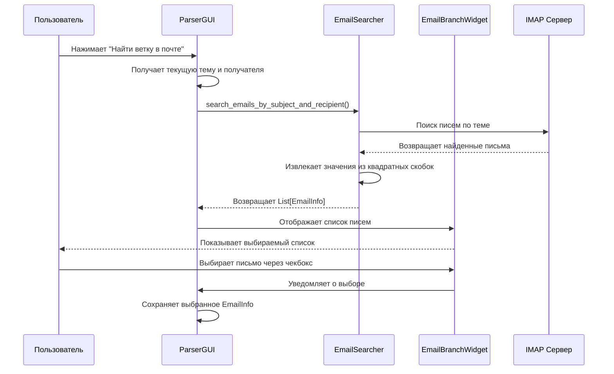
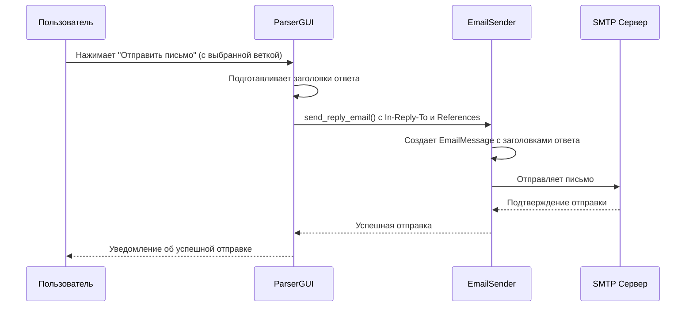
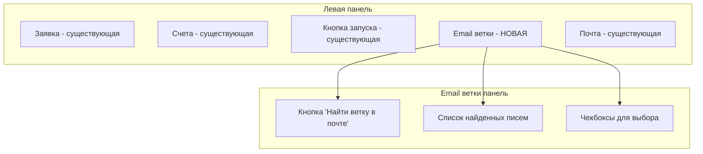

# Дизайн функции поиска веток в почте

## Обзор

Данный документ описывает реализацию функции поиска веток в почте для приложения Parser2. Функция позволит:

1. Искать существующие письма с такой же темой тому же получателю
2. Отображать найденные письма в списке с метаданными (дата, значения в квадратных скобках)
3. Выбирать одно письмо из списка для ответа
4. Отправлять новые письма как ответы на выбранную ветку с корректными заголовками

## Технологический стек и зависимости

### Существующие зависимости
- **GUI Framework**: Tkinter (стандартная библиотека)
- **Email Service**: `email_service/sender.py` с поддержкой SMTP
- **Конфигурация**: переменные окружения и `secrets.json`

### Новые зависимости
```
imaplib (стандартная библиотека) - получение писем через IMAP
email (стандартная библиотека) - парсинг и обработка писем
re (стандартная библиотека) - извлечение значений из квадратных скобок
```

## Архитектура компонентов

### Новые компоненты

#### 1. EmailSearcher (`email_service/searcher.py`)
```python
class EmailSearcher:
    def __init__(self, imap_server, imap_port, username, password)
    def search_emails_by_subject_and_recipient(self, subject, to_email) -> List[EmailInfo]
    def extract_bracket_value(self, email_body) -> str
    def connect_imap(self) -> imaplib.IMAP4_SSL
```

#### 2. EmailInfo модель данных (`models/schemas.py`)
```python
from dataclasses import dataclass
from datetime import datetime
from typing import List

@dataclass
class EmailInfo:
    message_id: str
    subject: str
    date: datetime
    bracket_value: str  # Значение из квадратных скобок
    sender: str
    references: List[str]
    reply_to: str
```

#### 3. EmailBranchWidget (`gui/components/email_branch_widget.py`)
- Прокручиваемый фрейм для отображения найденных писем
- Чекбоксы для выбора письма (одиночный выбор)
- Формат отображения: "Дата | Тема [значение_в_скобках]"

### Модифицированные компоненты

#### 1. ParserGUI (`gui.py`)
**Новые UI элементы:**
- Кнопка "Найти ветку в почте" рядом с кнопкой "Отправить письмо"
- Панель EmailBranchWidget рядом с областью выбора счетов
- Управление состоянием выбора письма

**Новые методы:**
```python
def _on_find_email_branch(self)
def _on_email_selected(self, email_info: EmailInfo)
def _send_reply_email(self, reply_to_email: EmailInfo)
def _build_email_branch_ui(self)
```

#### 2. EmailSender (`email_service/sender.py`)
**Расширенные методы:**
```python
def send_reply_email(self, subject, body, to_email, attachment_paths,
                    reply_to_message_id=None, references=None, from_name="Игорь Бяков")
```

#### 3. Конфигурация (`config.py`)
**Новые настройки IMAP:**
```python
IMAP_SERVER: str = _get("IMAP_SERVER", "imap.gmail.com")
IMAP_PORT: int = int(_get("IMAP_PORT", 993))
IMAP_USE_SSL: bool = str(_get("IMAP_USE_SSL", "1")).strip() in ("1", "true", "True")
```

## Диаграммы архитектуры

### Поток поиска писем



### Поток ответа на письмо



## Пользовательский интерфейс

### Изменения в макете GUI



### Расположение новых элементов

1. **Кнопка "Найти ветку в почте"** - справа от кнопки "Отправить письмо"
2. **Панель поиска веток** - между блоком кнопки запуска и блоком почты
3. **Список найденных писем** - прокручиваемый список с чекбоксами

## Логика работы с данными

### Извлечение значений из квадратных скобок

```python
import re

def extract_bracket_value(email_body: str) -> str:
    """Извлекает значение из квадратных скобок в тексте письма"""
    pattern = r'\[([^\]]+)\]'
    matches = re.findall(pattern, email_body)
    return matches[0] if matches else ""
```

### Поиск писем по теме и получателю

```python
def search_emails_by_subject_and_recipient(self, subject: str, to_email: str) -> List[EmailInfo]:
    """Ищет письма с похожей темой тому же получателю"""
    # Удаляем суффиксы типа "(#ПЕР)" для поиска
    clean_subject = re.sub(r'\(#[^)]+\)', '', subject).strip()
    
    # IMAP поиск по теме и получателю
    search_criteria = f'(SUBJECT "{clean_subject}" TO "{to_email}")'
    
    # Обработка результатов и создание EmailInfo объектов
```

### Формирование заголовков ответа

```python
def prepare_reply_headers(original_email: EmailInfo) -> dict:
    """Подготавливает заголовки для ответа на письмо"""
    headers = {
        'In-Reply-To': original_email.message_id,
        'References': ' '.join(original_email.references + [original_email.message_id])
    }
    return headers
```

## Обработка ошибок

### Типы ошибок и обработка

1. **Ошибки подключения IMAP**
   - Неверные учетные данные
   - Проблемы с сетью
   - Недоступность сервера

2. **Ошибки парсинга писем**
   - Поврежденные письма
   - Неподдерживаемые кодировки
   - Отсутствие обязательных заголовков

3. **Ошибки пользовательского интерфейса**
   - Пустые поля при поиске
   - Отсутствие выбранного письма при отправке

### Стратегия обработки

```python
try:
    # IMAP операции
except imaplib.IMAP4.error as e:
    logger.error(f"IMAP ошибка: {e}")
    messagebox.showerror("Ошибка", f"Не удалось подключиться к почте: {e}")
except Exception as e:
    logger.error(f"Общая ошибка поиска писем: {e}")
    messagebox.showerror("Ошибка", f"Ошибка поиска: {e}")
```

### 6. Модификации в ParserGUI (gui.py)

#### 6.1 Добавление импортов
```python
# Добавить в начало файла
from email_service.searcher import EmailSearcher
from models.schemas import EmailInfo
from gui.components.email_branch_widget import EmailBranchWidget
```

#### 6.2 Инициализация в __init__
```python
# Добавить в __init__ после существующих переменных
self.email_searcher = None  # Инициализируем позже
self.email_branch_widget = None
self.selected_reply_email = None  # Выбранное письмо для ответа
```

#### 6.3 Модификация _build_ui()
```python
# В _build_ui() после создания btn_frame, добавить:

# 3.5) Email ветки - новый блок
branch_frame = ttk.LabelFrame(left_paned, text="Поиск веток в почте")
left_paned.add(branch_frame, weight=1)

# Кнопка поиска
branch_btn_frame = ttk.Frame(branch_frame)
branch_btn_frame.pack(fill=tk.X, padx=4, pady=4)

self.find_branch_btn = ttk.Button(
    branch_btn_frame,
    text="Найти ветку в почте",
    command=self._on_find_email_branch,
    state=tk.DISABLED
)
self.find_branch_btn.pack(side=tk.LEFT, padx=(0, 8))

# Статус поиска
self.branch_status_label = ttk.Label(branch_btn_frame, text="Заполните поля почты для поиска")
self.branch_status_label.pack(side=tk.LEFT, padx=(8, 0))

# Виджет списка писем
self.email_branch_widget = EmailBranchWidget(
    branch_frame,
    on_selection_changed=self._on_email_selected
)
```

#### 6.4 Модификация блока почты
```python
# В блоке почты (после создания self.peredelka_cb), добавить:

# Кнопка поиска ветки рядом с отправкой
self.find_branch_btn_mail = ttk.Button(
    right_mail_col,
    text="Найти ветку",
    command=self._on_find_email_branch,
    state=tk.DISABLED
)
self.find_branch_btn_mail.pack(anchor="n", pady=(0, 6))

# Переносим кнопку отправки ниже
self.send_btn.pack(anchor="n")
```

#### 6.5 Новые методы
```python
def _init_email_searcher(self):
    """Инициализирует EmailSearcher при первом использовании."""
    if self.email_searcher is None:
        try:
            self.email_searcher = EmailSearcher()
            self._logger.info("EmailSearcher инициализирован")
        except Exception as e:
            self._logger.error(f"Ошибка инициализации EmailSearcher: {e}")
            messagebox.showerror("Ошибка", f"Не удалось инициализировать поиск по почте: {e}")
            return False
    return True

def _validate_email_search_fields(self) -> bool:
    """Проверяет, что поля почты заполнены для поиска."""
    to_email = self.to_entry.get().strip()
    subject = self.subj_entry.get().strip()
    
    has_fields = bool(to_email and subject)
    
    # Обновляем состояние кнопок
    state = tk.NORMAL if has_fields else tk.DISABLED
    self.find_branch_btn.configure(state=state)
    self.find_branch_btn_mail.configure(state=state)
    
    # Обновляем статус
    if has_fields:
        self.branch_status_label.configure(text="Готов к поиску")
    else:
        self.branch_status_label.configure(text="Заполните поля почты для поиска")
    
    return has_fields

def _on_find_email_branch(self):
    """Обработчик кнопки поиска ветки в почте."""
    if not self._validate_email_search_fields():
        messagebox.showwarning("Проверка", "Заполните поля 'Кому' и 'Тема' для поиска.")
        return
    
    if not self._init_email_searcher():
        return
    
    # Получаем данные для поиска
    to_email = self.to_entry.get().strip()
    subject = self.subj_entry.get().strip()
    
    # Блокируем кнопки на время поиска
    self.find_branch_btn.configure(state=tk.DISABLED)
    self.find_branch_btn_mail.configure(state=tk.DISABLED)
    self.branch_status_label.configure(text="Поиск...")
    
    # Запускаем поиск в отдельном потоке
    threading.Thread(
        target=self._search_email_branch_thread,
        args=(subject, to_email),
        daemon=True
    ).start()

def _search_email_branch_thread(self, subject: str, to_email: str):
    """Поиск писем в отдельном потоке."""
    try:
        emails = self.email_searcher.search_emails_by_subject_and_recipient(subject, to_email)
        
        # Обновляем UI в основном потоке
        self.after(0, lambda: self._update_email_search_results(emails))
        
    except Exception as e:
        self._logger.error(f"Ошибка поиска писем: {e}")
        self.after(0, lambda: self._update_email_search_error(str(e)))

def _update_email_search_results(self, emails: List[EmailInfo]):
    """Обновляет результаты поиска в UI."""
    try:
        # Обновляем список писем
        self.email_branch_widget.set_emails(emails)
        
        # Обновляем статус
        if emails:
            self.branch_status_label.configure(text=f"Найдено писем: {len(emails)}")
        else:
            self.branch_status_label.configure(text="Письма не найдены")
        
        # Восстанавливаем кнопки
        if self._validate_email_search_fields():
            self.find_branch_btn.configure(state=tk.NORMAL)
            self.find_branch_btn_mail.configure(state=tk.NORMAL)
        
        self._logger.info(f"Поиск завершен. Найдено: {len(emails)} писем")
        
    except Exception as e:
        self._logger.error(f"Ошибка обновления UI: {e}")

def _update_email_search_error(self, error_msg: str):
    """Обновляет UI при ошибке поиска."""
    try:
        self.branch_status_label.configure(text="Ошибка поиска")
        
        # Восстанавливаем кнопки
        if self._validate_email_search_fields():
            self.find_branch_btn.configure(state=tk.NORMAL)
            self.find_branch_btn_mail.configure(state=tk.NORMAL)
        
        messagebox.showerror("Ошибка поиска", f"Не удалось найти письма:\n{error_msg}")
        
    except Exception as e:
        self._logger.error(f"Ошибка обновления UI при ошибке: {e}")

def _on_email_selected(self, email_info: Optional[EmailInfo]):
    """Обработчик выбора письма из списка."""
    self.selected_reply_email = email_info
    
    if email_info:
        self._logger.info(f"Выбрано письмо для ответа: {email_info.subject}")
        
        # Обновляем текст кнопки отправки
        self.send_btn.configure(text="Ответить на письмо")
    else:
        self._logger.info("Отменен выбор письма для ответа")
        
        # Возвращаем обычный текст кнопки
        self.send_btn.configure(text="Отправить письмо")
```

#### 6.6 Модификация _send_mail()
```python
# В методе _send_mail() заменить вызов core.send_email_with_attachments:

def _send_mail(self):
    # ... существующий код проверок ...
    
    # Отправка в отдельном потоке
    def _send():
        try:
            # ... существующие проверки SMTP ...
            
            # Создаем EmailSender
            from email_service.sender import EmailSender
            email_sender = EmailSender(
                smtp_server=smtp_server,
                smtp_port=smtp_port,
                smtp_user=smtp_user,
                smtp_password=smtp_password,
                from_email=from_email
            )
            
            # Проверяем, есть ли выбранное письмо для ответа
            if self.selected_reply_email:
                # Отправляем ответ
                email_sender.send_reply_email(
                    subject=subject,
                    body=body,
                    to_email=to_email,
                    attachment_paths=attachments,
                    reply_to_message_id=self.selected_reply_email.message_id,
                    references=self.selected_reply_email.references
                )
                self._logger.info(f"Отправлен ответ на письмо: {self.selected_reply_email.message_id}")
            else:
                # Обычная отправка
                email_sender.send_email_with_attachments(
                    subject=subject,
                    body=body,
                    to_email=to_email,
                    attachment_paths=attachments
                )
                self._logger.info("Отправлено новое письмо")
            
            # ... остальной код ...
            
        except Exception as e:
            messagebox.showerror("Почта", f"Ошибка при отправке письма: {e}")
    
    threading.Thread(target=_send, daemon=True).start()
```

#### 6.7 Модификация _reset_after_send()
```python
# Добавить в _reset_after_send() очистку выбора письма:

# Очищаем выбор письма для ответа
try:
    self.selected_reply_email = None
    if self.email_branch_widget:
        self.email_branch_widget.clear_selection()
    # Возвращаем обычный текст кнопки
    self.send_btn.configure(text="Отправить письмо")
except Exception:
    pass
```

#### 6.8 Модификация обработчиков полей почты
```python
# Добавить обработчики для полей почты:

# В _build_ui() после создания полей почты:
self.to_entry.bind('<KeyRelease>', lambda e: self._validate_email_search_fields())
self.subj_entry.bind('<KeyRelease>', lambda e: self._validate_email_search_fields())
```

### 7. Модификация config.py

```python
# Добавить в конец файла config.py:

# IMAP настройки для поиска писем
IMAP_SERVER: str = _get("IMAP_SERVER", "imap.gmail.com")  # IMAP сервер
IMAP_PORT: int = int(_get("IMAP_PORT", 993))  # Порт IMAP сервера
IMAP_USE_SSL: bool = str(_get("IMAP_USE_SSL", "1")).strip() in ("1", "true", "True")  # Использовать SSL
IMAP_USER: str | None = _get("IMAP_USER", SMTP_USER)  # Пользователь IMAP (по умолчанию как SMTP_USER)
IMAP_PASSWORD: str | None = _get("IMAP_PASSWORD", SMTP_PASSWORD)  # Пароль IMAP (по умолчанию как SMTP_PASSWORD)

# Настройки поиска писем
EMAIL_SEARCH_LIMIT: int = int(_get("EMAIL_SEARCH_LIMIT", 50))  # Максимум писем в результатах
EMAIL_SEARCH_DAYS: int = int(_get("EMAIL_SEARCH_DAYS", 30))  # Поиск за последние N дней
```

## Порядок реализации

### Шаг 1: Создание новых файлов

1. **Создать директорию** `gui/components/`
2. **Создать файл** `email_service/searcher.py` с классом EmailSearcher
3. **Создать файл** `gui/components/__init__.py`
4. **Создать файл** `gui/components/email_branch_widget.py` с EmailBranchWidget
5. **Создать файл** `launcher.bat` в корне проекта

### Шаг 2: Модификация существующих файлов

1. **Добавить EmailInfo** в `models/schemas.py`
2. **Расширить EmailSender** в `email_service/sender.py`
3. **Модифицировать GUI** в `gui.py`
4. **Добавить настройки IMAP** в `config.py`

### Шаг 3: Настройка конфигурации

1. **Добавить в secrets.json** или переменные окружения:
```json
{
  "IMAP_SERVER": "imap.gmail.com",
  "IMAP_PORT": 993,
  "IMAP_USER": "your_email@gmail.com",
  "IMAP_PASSWORD": "your_app_password"
}
```

2. **Настроить App Password** для Gmail (если используете Gmail)

### Шаг 4: Тестирование

1. **Запустить приложение** из папки с заказом
2. **Проверить отображение** нового блока "Поиск веток в почте"
3. **Заполнить поля почты** и проверить активацию кнопки поиска
4. **Нажать "Найти ветку"** и проверить поиск писем
5. **Выбрать письмо** и отправить ответ

### Шаг 5: Создание launcher.bat

Копировать `launcher.bat` в папки с заказами для облегчения запуска.

## Особенности реализации

### 1. Производительность
- Поиск писем выполняется в отдельном потоке
- Ограничение количества результатов (EMAIL_SEARCH_LIMIT)
- Ограничение периода поиска (EMAIL_SEARCH_DAYS)

### 2. Надежность
- Обработка ошибок подключения к IMAP
- Обработка ошибок парсинга писем
- Корректное закрытие IMAP соединения

### 3. Пользовательский интерфейс
- Интуитивно понятное расположение элементов
- Одиночный выбор письма через чекбоксы
- Визуальная обратная связь (статус поиска, смена текста кнопок)

### 4. Безопасность
- Конфиденциальные данные в secrets.json
- Никакого хранения паролей в коде
- Использование SSL для IMAP по умолчанию

```python
# IMAP настройки для поиска писем
IMAP_SERVER: str = _get("IMAP_SERVER", "imap.gmail.com")
IMAP_PORT: int = int(_get("IMAP_PORT", 993))
IMAP_USE_SSL: bool = str(_get("IMAP_USE_SSL", "1")).strip() in ("1", "true", "True")
IMAP_USER: str | None = _get("IMAP_USER", SMTP_USER)  # По умолчанию как SMTP_USER
IMAP_PASSWORD: str | None = _get("IMAP_PASSWORD", SMTP_PASSWORD)  # По умолчанию как SMTP_PASSWORD

# Настройки поиска
EMAIL_SEARCH_LIMIT: int = int(_get("EMAIL_SEARCH_LIMIT", 50))  # Максимум писем в результатах
EMAIL_SEARCH_DAYS: int = int(_get("EMAIL_SEARCH_DAYS", 30))  # Поиск за последние N дней
```

### Требуемые переменные окружения

```bash
# В secrets.json или переменных окружения
IMAP_SERVER=imap.gmail.com
IMAP_PORT=993
IMAP_USER=your_email@gmail.com
IMAP_PASSWORD=your_app_password
```

## Батник для запуска

### launcher.bat
```batch
@echo off
setlocal

REM Получаем текущую директорию
set "CURRENT_DIR=%~dp0"
set "CURRENT_DIR=%CURRENT_DIR:~0,-1%"

REM Путь к Python и GUI скрипту
set "PYTHON_PATH=python"
set "GUI_SCRIPT=D:\Program files\myProjects\Parser2\gui.py"

REM Переходим в текущую директорию как рабочую
cd /d "%CURRENT_DIR%"

REM Запускаем приложение с текущей папкой как рабочей директорией
echo Запуск Parser2 из папки: %CURRENT_DIR%
"%PYTHON_PATH%" "%GUI_SCRIPT%"

pause
```

## Детальная реализация компонентов

### 1. EmailInfo модель данных (добавить в models/schemas.py)

```python
from dataclasses import dataclass
from datetime import datetime
from typing import List

@dataclass
class EmailInfo:
    """Информация о найденном письме для отображения в списке"""
    message_id: str
    subject: str
    date: datetime
    bracket_value: str  # Значение из квадратных скобок
    sender: str
    references: List[str]
    reply_to: str
    
    def __str__(self):
        date_str = self.date.strftime("%d.%m.%Y %H:%M")
        return f"{date_str} | {self.subject} [{self.bracket_value}]"
```

### 2. EmailSearcher класс (email_service/searcher.py)

```python
"""Модуль для поиска писем через IMAP."""

import imaplib
import email
import re
from datetime import datetime
from typing import List, Optional
from email.header import decode_header
import config
from logging_setup import get_logger
from models.schemas import EmailInfo

logger = get_logger(__name__)


class EmailSearcher:
    """Класс для поиска писем через IMAP."""
    
    def __init__(self,
                 imap_server: Optional[str] = None,
                 imap_port: Optional[int] = None,
                 username: Optional[str] = None,
                 password: Optional[str] = None):
        """
        Инициализация IMAP клиента.
        
        Args:
            imap_server: IMAP сервер
            imap_port: Порт IMAP сервера
            username: Пользователь для аутентификации
            password: Пароль для аутентификации
        """
        self.imap_server = imap_server or getattr(config, 'IMAP_SERVER', 'imap.gmail.com')
        self.imap_port = imap_port or getattr(config, 'IMAP_PORT', 993)
        self.username = username or getattr(config, 'IMAP_USER', None) or getattr(config, 'SMTP_USER', None)
        self.password = password or getattr(config, 'IMAP_PASSWORD', None) or getattr(config, 'SMTP_PASSWORD', None)
        
        if not all([self.imap_server, self.username, self.password]):
            missing = []
            if not self.imap_server: missing.append("IMAP_SERVER")
            if not self.username: missing.append("IMAP_USER")
            if not self.password: missing.append("IMAP_PASSWORD")
            
            raise ValueError(f"Не заданы параметры IMAP: {', '.join(missing)}. "
                           "Укажите их в переменных окружения или config.")
    
    def connect_imap(self) -> imaplib.IMAP4_SSL:
        """Подключается к IMAP серверу."""
        try:
            imap = imaplib.IMAP4_SSL(self.imap_server, self.imap_port)
            imap.login(self.username, self.password)
            return imap
        except Exception as e:
            logger.error(f"Ошибка подключения к IMAP: {e}")
            raise RuntimeError(f"Не удалось подключиться к IMAP серверу: {e}")
    
    def extract_bracket_value(self, email_body: str) -> str:
        """Извлекает значение из квадратных скобок в тексте письма."""
        if not email_body:
            return ""
        
        # Ищем все значения в квадратных скобках
        pattern = r'\[([^\]]+)\]'
        matches = re.findall(pattern, email_body)
        
        # Возвращаем первое найденное значение или пустую строку
        return matches[0] if matches else ""
    
    def decode_mime_words(self, s: str) -> str:
        """Декодирует MIME-закодированные слова в заголовках."""
        try:
            decoded_fragments = decode_header(s)
            decoded_string = ''
            for fragment, encoding in decoded_fragments:
                if isinstance(fragment, bytes):
                    if encoding:
                        decoded_string += fragment.decode(encoding)
                    else:
                        decoded_string += fragment.decode('utf-8', errors='ignore')
                else:
                    decoded_string += str(fragment)
            return decoded_string
        except Exception:
            return s
    
    def parse_email_date(self, date_str: str) -> datetime:
        """Парсит дату из заголовка письма."""
        try:
            # Парсим стандартный формат RFC 2822
            return email.utils.parsedate_to_datetime(date_str)
        except Exception:
            # Если не удалось распарсить, возвращаем текущую дату
            return datetime.now()
    
    def search_emails_by_subject_and_recipient(self, subject: str, to_email: str) -> List[EmailInfo]:
        """
        Ищет письма с похожей темой тому же получателю.
        
        Args:
            subject: Тема для поиска
            to_email: Email получателя
            
        Returns:
            Список EmailInfo объектов
        """
        if not subject.strip() or not to_email.strip():
            return []
        
        # Очищаем тему от суффиксов типа "(#ПЕР)"
        clean_subject = re.sub(r'\(#[^)]+\)', '', subject).strip()
        
        email_infos = []
        imap = None
        
        try:
            imap = self.connect_imap()
            
            # Выбираем папку INBOX
            imap.select('INBOX')
            
            # Ограничиваем поиск последними N днями
            search_days = getattr(config, 'EMAIL_SEARCH_DAYS', 30)
            search_limit = getattr(config, 'EMAIL_SEARCH_LIMIT', 50)
            
            # Формируем критерий поиска
            # Ищем по теме И получателю
            search_criteria = f'(SUBJECT "{clean_subject}" TO "{to_email}")'
            
            logger.info(f"Поиск писем: {search_criteria}")
            
            # Выполняем поиск
            status, messages = imap.search(None, search_criteria)
            
            if status != 'OK':
                logger.warning(f"Поиск писем не удался: {status}")
                return []
            
            # Получаем ID сообщений
            message_ids = messages[0].split()
            
            if not message_ids:
                logger.info("Письма не найдены")
                return []
            
            # Ограничиваем количество результатов
            message_ids = message_ids[-search_limit:] if len(message_ids) > search_limit else message_ids
            
            logger.info(f"Найдено писем: {len(message_ids)}")
            
            # Обрабатываем каждое письмо
            for msg_id in message_ids:
                try:
                    # Получаем заголовки и тело письма
                    status, msg_data = imap.fetch(msg_id, '(RFC822)')
                    
                    if status != 'OK':
                        continue
                    
                    # Парсим письмо
                    raw_email = msg_data[0][1]
                    email_message = email.message_from_bytes(raw_email)
                    
                    # Извлекаем заголовки
                    message_id = email_message.get('Message-ID', '')
                    subject_header = email_message.get('Subject', '')
                    date_header = email_message.get('Date', '')
                    from_header = email_message.get('From', '')
                    references_header = email_message.get('References', '')
                    reply_to_header = email_message.get('Reply-To', from_header)
                    
                    # Декодируем заголовки
                    decoded_subject = self.decode_mime_words(subject_header)
                    decoded_from = self.decode_mime_words(from_header)
                    decoded_reply_to = self.decode_mime_words(reply_to_header)
                    
                    # Парсим дату
                    parsed_date = self.parse_email_date(date_header)
                    
                    # Извлекаем тело письма
                    body = self.extract_email_body(email_message)
                    
                    # Извлекаем значение из квадратных скобок
                    bracket_value = self.extract_bracket_value(body)
                    
                    # Парсим References
                    references = [ref.strip() for ref in references_header.split()] if references_header else []
                    
                    # Создаем EmailInfo
                    email_info = EmailInfo(
                        message_id=message_id,
                        subject=decoded_subject,
                        date=parsed_date,
                        bracket_value=bracket_value,
                        sender=decoded_from,
                        references=references,
                        reply_to=decoded_reply_to
                    )
                    
                    email_infos.append(email_info)
                    
                except Exception as e:
                    logger.warning(f"Ошибка обработки письма {msg_id}: {e}")
                    continue
            
            # Сортируем по дате (новые сначала)
            email_infos.sort(key=lambda x: x.date, reverse=True)
            
        except Exception as e:
            logger.error(f"Ошибка поиска писем: {e}")
            raise
        
        finally:
            if imap:
                try:
                    imap.close()
                    imap.logout()
                except Exception:
                    pass
        
        return email_infos
    
    def extract_email_body(self, email_message) -> str:
        """Извлекает текстовое тело письма."""
        body = ""
        
        try:
            if email_message.is_multipart():
                # Если письмо многочастное, ищем текстовые части
                for part in email_message.walk():
                    content_type = part.get_content_type()
                    if content_type == "text/plain":
                        payload = part.get_payload(decode=True)
                        if payload:
                            # Определяем кодировку
                            charset = part.get_content_charset() or 'utf-8'
                            try:
                                body += payload.decode(charset, errors='ignore')
                            except Exception:
                                body += payload.decode('utf-8', errors='ignore')
                        break
            else:
                # Простое письмо
                payload = email_message.get_payload(decode=True)
                if payload:
                    charset = email_message.get_content_charset() or 'utf-8'
                    try:
                        body = payload.decode(charset, errors='ignore')
                    except Exception:
                        body = payload.decode('utf-8', errors='ignore')
        
        except Exception as e:
            logger.warning(f"Ошибка извлечения тела письма: {e}")
        
        return body
    
    def test_connection(self) -> bool:
        """Тестирует подключение к IMAP серверу."""
        try:
            imap = self.connect_imap()
            imap.close()
            imap.logout()
            logger.info("IMAP подключение успешно протестировано")
            return True
        except Exception as e:
            logger.error(f"Ошибка тестирования IMAP подключения: {e}")
            return False
```

### 3. EmailBranchWidget компонент (gui/components/email_branch_widget.py)

```python
"""Виджет для отображения и выбора писем из найденной ветки."""

import tkinter as tk
from tkinter import ttk
from typing import List, Optional, Callable
from models.schemas import EmailInfo


class EmailBranchWidget:
    """Виджет для отображения списка найденных писем с возможностью выбора."""
    
    def __init__(self, parent_frame: ttk.Frame, on_selection_changed: Optional[Callable] = None):
        """
        Инициализация виджета.
        
        Args:
            parent_frame: Родительский фрейм
            on_selection_changed: Callback при изменении выбора
        """
        self.parent_frame = parent_frame
        self.on_selection_changed = on_selection_changed
        self.emails: List[EmailInfo] = []
        self.selected_email: Optional[EmailInfo] = None
        self.email_vars = {}  # {EmailInfo: BooleanVar}
        
        self._build_ui()
    
    def _build_ui(self):
        """Создает интерфейс виджета."""
        # Фрейм с прокруткой
        self.canvas = tk.Canvas(self.parent_frame, height=120)
        self.scrollbar = ttk.Scrollbar(self.parent_frame, orient="vertical", command=self.canvas.yview)
        self.scrollable_frame = ttk.Frame(self.canvas)
        
        self.scrollable_frame.bind(
            "<Configure>",
            lambda e: self.canvas.configure(scrollregion=self.canvas.bbox("all"))
        )
        
        self.canvas.create_window((0, 0), window=self.scrollable_frame, anchor="nw")
        self.canvas.configure(yscrollcommand=self.scrollbar.set)
        
        self.canvas.pack(side=tk.LEFT, fill=tk.BOTH, expand=True)
        self.scrollbar.pack(side=tk.RIGHT, fill=tk.Y)
        
        # Сообщение когда список пуст
        self.empty_label = ttk.Label(self.scrollable_frame, text="Нажмите 'Найти ветку в почте' для поиска")
        self.empty_label.pack(pady=20)
    
    def set_emails(self, emails: List[EmailInfo]):
        """Устанавливает список писем для отображения."""
        self.emails = emails
        self.selected_email = None
        self.email_vars.clear()
        
        # Очищаем текущий список
        for child in list(self.scrollable_frame.winfo_children()):
            child.destroy()
        
        if not emails:
            # Показываем сообщение о пустом списке
            self.empty_label = ttk.Label(self.scrollable_frame, text="Письма не найдены")
            self.empty_label.pack(pady=20)
        else:
            # Создаем чекбоксы для каждого письма
            for email_info in emails:
                var = tk.BooleanVar(value=False)
                self.email_vars[email_info] = var
                
                # Форматируем текст для отображения
                display_text = str(email_info)
                
                checkbox = ttk.Checkbutton(
                    self.scrollable_frame,
                    text=display_text,
                    variable=var,
                    command=lambda ei=email_info: self._on_email_checkbox_changed(ei)
                )
                checkbox.pack(anchor="w", padx=5, pady=2)
    
    def _on_email_checkbox_changed(self, selected_email: EmailInfo):
        """Обработчик изменения состояния чекбокса письма."""
        selected_now = self.email_vars[selected_email].get()
        
        if selected_now:
            # Если выбрали это письмо, снимаем выбор с остальных
            for email_info, var in self.email_vars.items():
                if email_info != selected_email and var.get():
                    var.set(False)
            
            self.selected_email = selected_email
        else:
            # Если сняли выбор с этого письма
            if self.selected_email == selected_email:
                self.selected_email = None
        
        # Вызываем callback
        if self.on_selection_changed:
            self.on_selection_changed(self.selected_email)
    
    def get_selected_email(self) -> Optional[EmailInfo]:
        """Возвращает выбранное письмо."""
        return self.selected_email
    
    def clear_selection(self):
        """Очищает выбор."""
        for var in self.email_vars.values():
            var.set(False)
        self.selected_email = None
        
        if self.on_selection_changed:
            self.on_selection_changed(None)
```

### 4. Расширение EmailSender (email_service/sender.py)

```python
# Добавить в класс EmailSender метод для отправки ответов

def send_reply_email(self,
                    subject: str,
                    body: str,
                    to_email: str,
                    attachment_paths: List[str],
                    reply_to_message_id: Optional[str] = None,
                    references: Optional[List[str]] = None,
                    from_name: str = "Игорь Бяков") -> None:
    """
    Отправляет email как ответ на существующее письмо.
    
    Args:
        subject: Тема письма
        body: Текст письма
        to_email: Email получателя
        attachment_paths: Список путей к файлам для вложения
        reply_to_message_id: Message-ID письма, на которое отвечаем
        references: Список References для цепочки писем
        from_name: Имя отправителя
        
    Raises:
        RuntimeError: При ошибке отправки
    """
    if not subject.strip():
        raise ValueError("Тема письма не может быть пустой")
    if not body.strip():
        raise ValueError("Текст письма не может быть пустым")
    if not to_email.strip():
        raise ValueError("Email получателя не может быть пустым")
    
    # Проверяем существование файлов
    missing_files = []
    for path in attachment_paths:
        if not os.path.exists(path):
            missing_files.append(path)
    
    if missing_files:
        raise FileNotFoundError(f"Файлы для вложения не найдены: {', '.join(missing_files)}")
    
    # Создаем сообщение
    msg = EmailMessage()
    msg['Subject'] = subject
    msg['From'] = f'{from_name} <{self.from_email}>'
    msg['To'] = to_email
    
    # Добавляем заголовки для ответа, если указаны
    if reply_to_message_id:
        msg['In-Reply-To'] = reply_to_message_id
        
        # Формируем References
        if references:
            all_references = references + [reply_to_message_id]
        else:
            all_references = [reply_to_message_id]
        
        msg['References'] = ' '.join(all_references)
        
        logger.info(f"Отправка ответа на письмо: {reply_to_message_id}")
    
    msg.set_content(body)
    
    # Добавляем вложения
    for attachment_path in attachment_paths:
        try:
            with open(attachment_path, 'rb') as f:
                file_data = f.read()
                file_name = os.path.basename(attachment_path)
            msg.add_attachment(file_data, maintype='application', subtype='octet-stream', filename=file_name)
            logger.debug(f"Добавлено вложение: {file_name}")
        except Exception as e:
            logger.error(f"Ошибка добавления вложения {attachment_path}: {e}")
            raise RuntimeError(f"Не удалось добавить вложение {attachment_path}: {e}")
    
    # Отправляем письмо
    t_send_start = time.perf_counter()
    try:
        with smtplib.SMTP_SSL(self.smtp_server, self.smtp_port) as smtp:
            smtp.login(self.smtp_user, self.smtp_password)
            smtp.send_message(msg)
    except Exception as e:
        logger.error(f"Ошибка отправки email: {e}")
        raise RuntimeError(f"Не удалось отправить письмо: {e}")
    
    t_send_end = time.perf_counter()
    file_names = [os.path.basename(p) for p in attachment_paths]
    logger.info(f"Письмо-ответ с файлами {', '.join(file_names)} отправлено на {to_email} за {t_send_end - t_send_start:.2f} с")
```

### 5. Launcher.bat для запуска

```batch
@echo off
setlocal

REM Получаем текущую директорию
set "CURRENT_DIR=%~dp0"
set "CURRENT_DIR=%CURRENT_DIR:~0,-1%"

REM Путь к Python и GUI скрипту
set "PYTHON_PATH=python"
set "GUI_SCRIPT=D:\Program files\myProjects\Parser2\gui.py"

REM Переходим в текущую директорию как рабочую
cd /d "%CURRENT_DIR%"

REM Запускаем приложение с текущей папкой как рабочей директорией
echo Запуск Parser2 из папки: %CURRENT_DIR%
"%PYTHON_PATH%" "%GUI_SCRIPT%"

if errorlevel 1 (
    echo.
    echo Ошибка запуска приложения!
    echo Проверьте:
    echo 1. Установлен ли Python
    echo 2. Существует ли файл %GUI_SCRIPT%
    echo 3. Установлены ли зависимости (pip install -r requirements.txt)
    echo.
)

pause
```

### Unit тесты

```python
# tests/test_email_searcher.py
def test_extract_bracket_value():
    body = "Какой-то текст [Изделие: 1000.50] и еще текст"
    result = extract_bracket_value(body)
    assert result == "Изделие: 1000.50"

def test_search_emails_connection():
    # Мок тест подключения к IMAP
    pass

def test_reply_headers_formation():
    # Тест формирования заголовков ответа
    pass
```

### Интеграционные тесты

```python
# tests/test_email_integration.py
def test_full_email_search_flow():
    # Тест полного потока поиска и выбора писем
    pass

def test_reply_sending():
    # Тест отправки ответа с корректными заголовками
    pass
```