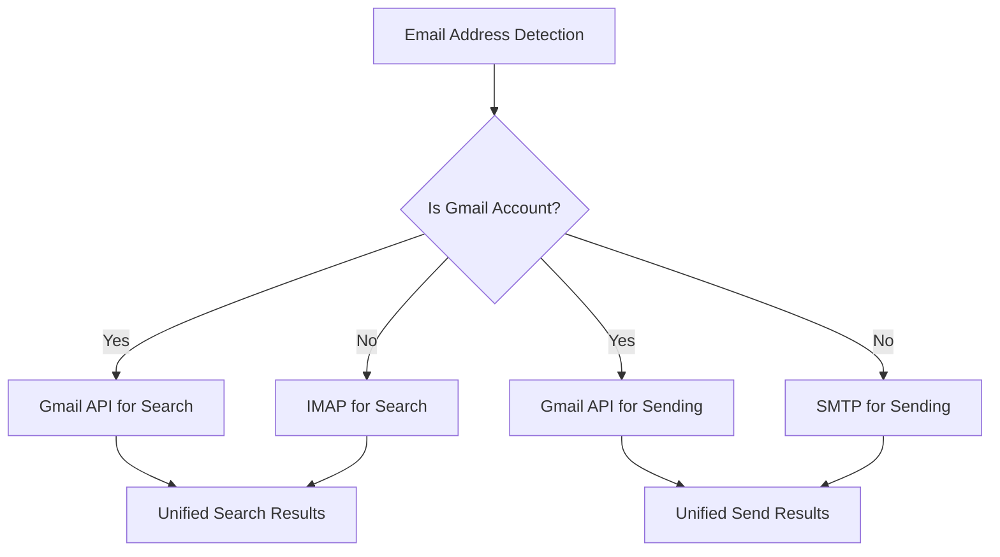
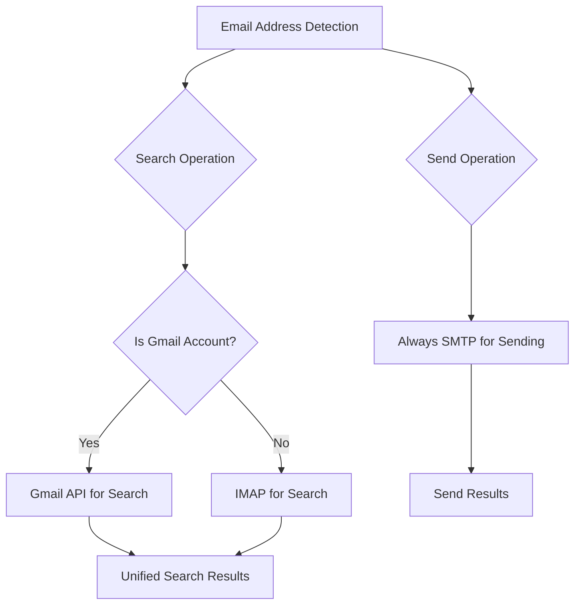

# Рефакторинг Gmail API: Интеграция только для поиска

## Обзор

Данный документ описывает рефакторинг интеграции Gmail API для разделения функций поиска и отправки писем. В настоящее время приложение использует Gmail API как для поиска, так и для отправки писем при обнаружении Gmail адреса. Новая архитектура будет использовать Gmail API только для замены IMAP в функциях поиска, в то время как для отправки писем всегда будет использоваться SMTP независимо от почтового провайдера.

## Анализ текущей архитектуры

### Существующая реализация

Текущая система использует унифицированный подход, где Gmail API применяется для обеих операций:



### Структура текущих компонентов

- **UnifiedEmailSender**: Использует Gmail API для отправки, если `should_use_gmail_api()` возвращает true
- **UnifiedEmailSearcher**: Использует Gmail API для поиска, если `should_use_gmail_api()` возвращает true
- **should_use_gmail_api()**: Единая функция, определяющая использование Gmail API для обеих операций

## Целевая архитектура

### Новая модель разделения



### Преимущества новой архитектуры

1. **Надёжность**: SMTP более надёжен для отправки, чем Gmail API
2. **Согласованность**: Все письма отправляются через один протокол независимо от провайдера
3. **Упрощённая конфигурация**: Не требуется настройка send-as алиасов для Gmail API
4. **Лучшая производительность**: Gmail API оптимизирован для поиска, SMTP для отправки
5. **Меньше зависимостей**: Требуется меньше разрешений Gmail API

## План реализации

### 1. Разделение логики почтового провайдера

Создание отдельных функций для определения методов поиска и отправки:

#### Текущая функция (для модификации)
```python
def should_use_gmail_api(email: str) -> bool:
    """Единая функция для операций поиска и отправки"""
```

#### Новые функции
```python
def should_use_gmail_api_for_search(email: str) -> bool:
    """Определяет, следует ли использовать Gmail API для поиска писем"""
    
def should_use_smtp_for_sending(email: str) -> bool:
    """Всегда возвращает True - вся отправка через SMTP"""
```

### 2. Модификации UnifiedEmailSender

#### Текущее поведение
- Сначала пытается использовать Gmail API для Gmail аккаунтов
- Переключается на SMTP при неудаче

#### Новое поведение  
- Всегда использует SMTP для всех почтовых провайдеров
- Убирает зависимость от Gmail API для отправки

```mermaid
flowchart TD
    A[send_email()] --> B[Validate Input]
    B --> C[Always Use SMTP]
    C --> D[Create EmailMessage]
    D --> E[Add Attachments]
    E --> F[Send via SMTP]
    F --> G[Log Success]
```

### 3. Модификации UnifiedEmailSearcher

#### Текущее поведение
- Использует Gmail API для Gmail аккаунтов
- Переключается на IMAP для других провайдеров

#### Новое поведение (без изменений)
- Продолжает использовать Gmail API для поиска в Gmail
- Сохраняет IMAP fallback для других провайдеров

### 4. Изменения конфигурации

#### Удаление конфигурации отправки Gmail
- Убрать влияние `USE_GMAIL_API` на отправку
- Оставить `USE_GMAIL_API` только для операций поиска
- Обеспечить постоянную доступность конфигурации SMTP

#### Обновление документации
- Уточнить, что Gmail API используется только для поиска
- Подчеркнуть требование SMTP для всей отправки

## Изменения компонентов

### Модифицируемые компоненты

#### lib/email_provider.py
```python
def should_use_gmail_api_for_search(email: str) -> bool:
    """Gmail API только для операций поиска"""
    use_gmail_api = getattr(config, 'USE_GMAIL_API', True)
    if not use_gmail_api:
        return False
    return is_google_account(email)

def should_use_smtp_for_sending(email: str) -> bool:
    """Всегда использовать SMTP для отправки"""
    return True

# Сохранение существующей should_use_gmail_api() для обратной совместимости
# но с пометкой как устаревшая и перенаправлением на функцию поиска
def should_use_gmail_api(email: str) -> bool:
    """Устарела: Используйте should_use_gmail_api_for_search() вместо этой"""
    return should_use_gmail_api_for_search(email)
```

#### lib/email_sender.py
```python
class UnifiedEmailSender:
    def __init__(self, from_email: Optional[str] = None):
        # Убираем инициализацию Gmail сервиса
        self.from_email = normalize_email(from_email or config.FROM_EMAIL or config.SMTP_USER or "")
        # Больше нет self.gmail_service
    
    def send_email(self, to_email: str, subject: str, body: str, 
                   attachments: Optional[List[str]] = None,
                   from_name: Optional[str] = None) -> bool:
        # Убираем попытку Gmail API
        # Всегда используем SMTP
        return self._send_via_smtp(to_email, subject, body, attachments, from_name)
    
    def send_reply(self, to_email: str, subject: str, body: str,
                   original_message_id: Optional[str] = None,
                   references: Optional[List[str]] = None,
                   attachments: Optional[List[str]] = None,
                   from_name: Optional[str] = None) -> bool:
        # Убираем попытку Gmail API
        # Всегда используем SMTP
        return self._send_reply_via_smtp(to_email, subject, body, 
                                        original_message_id, references, 
                                        attachments, from_name)
```

#### lib/email_searcher.py
```python
class UnifiedEmailSearcher:
    def _init_gmail_service(self):
        # Используем новую функцию, специфичную для поиска
        if should_use_gmail_api_for_search(self.account_email):
            try:
                self.gmail_service = GmailService()
                logger.info("Gmail API сервис для поиска инициализирован")
            except Exception as e:
                logger.warning(f"Не удалось инициализировать Gmail API для поиска: {e}")
                self.gmail_service = None
    
    def search_emails_by_recipient(self, to_email: str, subject: str = "") -> List[EmailInfo]:
        # Используем новую функцию, специфичную для поиска
        if self.gmail_service and should_use_gmail_api_for_search(self.account_email):
            try:
                return self._search_via_gmail_api(to_email, subject)
            except Exception as e:
                logger.warning(f"Ошибка поиска через Gmail API: {e}, пробуем IMAP")
        
        return self._search_via_imap(to_email, subject)
```

## Стратегия миграции

### Фаза 1: Разделение функций
1. Добавить новые функции определения провайдера
2. Сохранить существующие функции для обратной совместимости
3. Добавить предупреждения об устаревании к старым функциям

### Фаза 2: Рефакторинг отправителя
1. Модифицировать UnifiedEmailSender для постоянного использования SMTP
2. Убрать инициализацию Gmail API из отправителя
3. Обновить все вызовы методов отправки

### Фаза 3: Обновления поисковика
1. Обновить UnifiedEmailSearcher для использования новой функции поиска
2. Протестировать сохранность функциональности поиска Gmail API
3. Проверить продолжение работы IMAP fallback

### Фаза 4: Очистка и удаление мёртвого кода
1. Удалить устаревшие функции после переходного периода
2. Очистить код, связанный с отправкой через Gmail API
3. Удалить весь неиспользуемый код (dead code)
4. Обновить документацию по конфигурации

## Стратегия тестирования

### Модульные тесты
- Тестирование новых функций определения провайдера
- Проверка работы SMTP отправки для всех типов почты
- Обеспечение продолжения работы поиска Gmail API
- Тестирование IMAP поиска fallback

### Интеграционные тесты
- End-to-end отправка писем только через SMTP
- Валидация функциональности поиска Gmail
- Сценарии обработки ошибок и fallback
- Загрузка и валидация конфигурации

### Критерии валидации
- Все письма отправляются через SMTP независимо от провайдера
- Поиск Gmail работает с Gmail API
- Поиск не-Gmail работает с IMAP
- Отсутствие регрессии в существующей функциональности
- Улучшенная надёжность и согласованность

### Модульные тесты
- Тестирование новых функций определения провайдера
- Проверка работы SMTP отправки для всех типов почты
- Обеспечение продолжения работы поиска Gmail API
- Тестирование IMAP поиска fallback

### Интеграционные тесты
- End-to-end отправка писем только через SMTP
- Валидация функциональности поиска Gmail
- Сценарии обработки ошибок и fallback
- Загрузка и валидация конфигурации

### Критерии валидации
- Все письма отправляются через SMTP независимо от провайдера
- Поиск Gmail работает с Gmail API
- Поиск не-Gmail работает с IMAP
- Отсутствие регрессии в существующей функциональности
- Улучшенная надёжность и согласованность

## Очистка мёртвого кода

После завершения рефакторинга необходимо провести тщательную очистку кодовой базы от неиспользуемого кода.

### Методология поиска мёртвого кода

#### 1. Анализ функций и методов
- Проверить все методы, связанные с отправкой Gmail API
- Удалить неиспользуемые помощники (helper methods)
- Убрать устаревшие функции после переходного периода

#### 2. Проверка импортов
- Найти неиспользуемые import статементы
- Удалить лишние зависимости Gmail API для отправки
- Оптимизировать списки импортов

#### 3. Переменные и константы
- Найти неиспользуемые переменные класса
- Удалить конфигурационные параметры, связанные с Gmail отправкой
- Очистить комментарии и докстринги

### Конкретные области для очистки

#### lib/email_sender.py
```python
# К удалению:
# - self.gmail_service инициализация
# - _init_gmail_service() метод
# - Все Gmail API логику в send_email() и send_reply()
# - Gmail-специфичные importы
# - Логирование Gmail API операций
# - test_connection() Gmail API часть
```

#### lib/email_provider.py
```python
# К удалению после переходного периода:
# - should_use_gmail_api() (заменяется should_use_gmail_api_for_search())
# - should_use_smtp_for_sending() (всегда True, можно убрать)
```

#### lib/gmail_service.py 
Потенциально к удалению (только если остался мёртвым):
```python
# Методы для отправки:
# - send_email() для отправки
# - send_reply() для ответов
# - _create_message() если только для отправки
# - _create_reply_message() если только для ответов
```

### Порядок очистки

#### Шаг 1: Поиск ссылок
1. Использовать `grep` для поиска всех ссылок на:
   - `gmail_service` переменные
   - `send_email` в Gmail контексте
   - `send_reply` в Gmail контексте
   - Отправку-специфичные конфигурации

#### Шаг 2: Проверка использования
1. Обеспечить, что никакие модули не ссылаются на удаляемый код
2. Проверить все файлы в проекте на наличие importов
3. Убедиться, что тесты не опираются на удаляемые части

#### Шаг 3: Безопасное удаление
1. Создать бекап перед удалением
2. Удалять код постепенно, проверяя работоспособность
3. Запускать тесты после каждого этапа

### Критерии успешной очистки

- Никаких неиспользуемых importов
- Отсутствие недостижимого кода
- Успешные тесты после очистки
- Сохранение всей функциональности
- Уменьшение размера кодовой базы
- Повышение читаемости кода

### Обновление документации

После очистки необходимо обновить соответствующую документацию:
- Удалить упоминания Gmail API для отправки
- Обновить диаграммы архитектуры
- Актуализировать API документацию
- Обновить руководства пользователя

### Низкий риск
- SMTP отправка уже реализована и протестирована
- Функциональность поиска Gmail остаётся неизменной
- Обратная совместимость поддерживается во время перехода

### Средний риск
- Изменения конфигурации могут потребовать обновлений от пользователей
- Существующие развёртывания нуждаются в проверке SMTP учётных данных

### Смягчение
- Постепенное развёртывание с feature flags
- Всестороннее тестирование всех почтовых провайдеров
- Чёткая документация по миграции
- План отката при возникновении проблем

## Требования к конфигурации

### Обязательные настройки SMTP
```json
{
  "SMTP_SERVER": "smtp.gmail.com",
  "SMTP_PORT": 587,
  "SMTP_USER": "user@example.com", 
  "SMTP_PASSWORD": "app_password",
  "FROM_EMAIL": "user@example.com",
  "FROM_NAME": "Игорь Бяков"
}
```

### Настройки поиска Gmail (без изменений)
```json
{
  "USE_GMAIL_API": true,
  "GMAIL_CREDENTIALS_PATH": "gmail_credentials.json",
  "GMAIL_TOKEN_PATH": "gmail_token.json",
  "EMAIL_SEARCH_DAYS": 30,
  "EMAIL_SEARCH_LIMIT": 50
}
```

Данный рефакторинг создаст более надёжную и поддерживаемую почтовую систему, используя сильные стороны каждого протокола: Gmail API для эффективных возможностей поиска и SMTP для надёжной доставки писем.