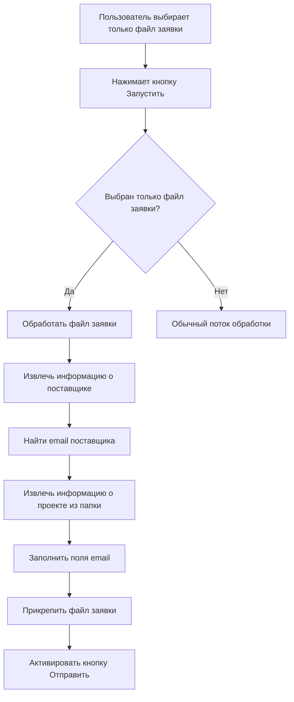

# Новая функциональность электронной почты - Техническая спецификация

## 1. Обзор

Этот документ описывает дизайн новой функциональности электронной почты в приложении Parser. Функция позволит пользователям автоматически заполнять поля электронной почты, когда выбран только файл заявки (запроса), без файлов счетов. При нажатии кнопки "Запустить" система будет:

1. Извлекать информацию о поставщике из файла заявки
2. Искать адрес электронной почты поставщика в словаре поставщиков
3. Автоматически заполнять поля формы электронной почты:
   - Кому: адрес электронной почты поставщика из словаря
   - Тема: "ООО Лис заявка (37)(Кухня)" формат, где:
     - "ООО Лис заявка" - постоянное значение
     - "37" - номер договора, извлеченный из имени папки
     - "Кухня" - название изделия, извлеченное из имени папки
   - Текст: "Добрый день, во вложении."
   - Вложение: выбранный файл заявки

Дополнительно дизайн включает простой и эффективный способ добавления новых адресов электронной почты поставщиков в словарь поставщиков.

## 2. Архитектура

Реализация будет следовать существующей модульной архитектуре приложения Parser. Новая функциональность будет интегрирована в слой графического интерфейса с минимальными изменениями в базовой логике обработки.

### 2.1 Взаимодействие компонентов

1. Пользователь выбирает только файл заявки (без счетов)
2. Пользователь нажимает кнопку "Запустить"
3. Графический интерфейс проверяет, выбран ли только файл заявки
4. Если да, запускается новая функциональность электронной почты
5. Файл заявки обрабатывается для извлечения информации о поставщике
6. Адрес электронной почты поставщика ищется в словаре поставщиков
7. Информация о проекте извлекается из имени папки
8. Поля формы электронной почты заполняются
9. Файл заявки прикрепляется к письму

### 2.2 Поток данных



## 3. Детали реализации

### 3.1 Модификации графического интерфейса

#### 3.1.1 Улучшение обработчика кнопки запуска

Метод `_run_processing` в `gui.py` будет модифицирован для обнаружения, когда выбран только файл заявки, и запуска новой функциональности электронной почты.

#### 3.1.2 Новый метод заполнения электронной почты

Будет добавлен новый метод `_populate_email_for_application` для обработки заполнения полей электронной почты, когда выбран только файл заявки.

### 3.2 Управление словарем поставщиков

#### 3.2.1 Поиск поставщика

Существующая функция `replace_supplier_name` в `lib/utils.py` будет модифицирована для поиска адресов электронной почты поставщиков.

#### 3.2.2 Хранение адресов электронной почты поставщиков

Файл `supplier_replacements.json` будет использовать формат объектов:

```json
{
  "ООО кВсеИнструменты:ру": {
    "name": "ВсеИнструменты",
    "email": "info@vse-instrumenty.ru"
  },
  "ООО «ВсеИнструменты.ру»": {
    "name": "ВсеИнструменты", 
    "email": "orders@vse-instrumenty.ru"
  }
}
```

#### 3.2.3 Добавление новых поставщиков

Для добавления новых поставщиков мы реализуем простой подход:
1. Когда поставщик не найден в словаре, регистрируется предупреждение с именем поставщика
2. Предоставляется документация о том, как вручную добавить поставщиков в файл JSON
3. В будущих версиях можно добавить диалог графического интерфейса для добавления поставщиков

### 3.3 Извлечение информации о проекте

Существующая функция `parse_project_folder` в `lib/utils.py` уже извлекает информацию о проекте из имен папок в формате `(37)Петухова(Окулова, 28-35)(Кухня)`. Мы повторно используем эту функцию для извлечения номера договора и названия изделия.

## 4. Модели данных

### 4.1 Запись словаря поставщиков

Словарь поставщиков будет использовать формат объектов:

```python
# Формат словаря поставщиков
{
  "original_name": {
    "name": "normalized_name",
    "email": "supplier@email.com"
  }
}
```

### 4.2 Модель информации о проекте

Информация о проекте извлекается с использованием существующей функции:

```python
{
  'номер_договора': str,  # Номер договора
  'заказчик': str,        # Заказчик
  'адрес': str,           # Адрес
  'изделие': str,         # Изделие
  'project_dir': str      # Путь к директории проекта
}
```

## 5. Бизнес-логика

### 5.1 Логика заполнения полей электронной почты

1. Проверить, выбран ли только файл заявки (без счетов)
2. Обработать файл заявки для извлечения информации о поставщике
3. Найти поставщика в словаре, чтобы получить адрес электронной почты
4. Извлечь информацию о проекте из имени папки
5. Форматировать тему электронного письма, используя шаблон: "ООО Лис заявка ({номер_договора})({изделие})"
6. Установить текст письма как "Добрый день, во вложении."
7. Прикрепить файл заявки
8. Активировать кнопку отправки

### 5.2 Логика улучшения словаря поставщиков

1. Обновить функцию поиска поставщика для работы с новым форматом словаря
2. Добавить возможность поиска адресов электронной почты
3. Реализовать поиск по ключам словаря для сопоставления поставщиков
4. Вернуть нормализованное имя и email при нахождении совпадения

### 5.3 Логика обработки только заявки

1. При нажатии кнопки "Запустить" проверить, что выбран только один файл заявки и не выбраны счета
2. Если условие выполнено, запустить специальный обработчик для заявки
3. Извлечь данные из заявки и определить поставщика
4. Найти email поставщика в словаре
5. Извлечь информацию о проекте из имени папки
6. Заполнить поля email согласно спецификации
7. Прикрепить файл заявки
8. Активировать кнопку отправки

## 6. Тестирование

### 6.1 Модульные тесты

1. Тестировать поиск поставщика с использованием формата объектов словаря
2. Тестировать извлечение информации о проекте из имен папок
3. Тестировать форматирование темы электронного письма
4. Тестировать заполнение полей электронной почты в графическом интерфейсе
5. Тестировать прикрепление файлов заявок

### 6.2 Интеграционные тесты

1. Тестировать полный поток от выбора файла заявки до заполнения полей электронной почты
2. Тестировать с различными форматами словаря поставщиков
3. Тестировать с различными форматами имен папок проектов
4. Тестировать обработку ошибок, когда поставщики не найдены

### 6.3 Ручное тестирование

1. Проверить, что обычный поток обработки все еще работает, когда выбраны как файлы заявок, так и счетов
2. Проверить, что поля электронной почты правильно заполняются, когда выбран только файл заявки
3. Проверить, что файл заявки правильно прикрепляется
4. Проверить, что кнопка отправки активируется после заполнения