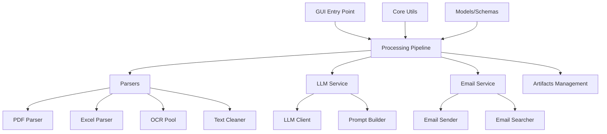
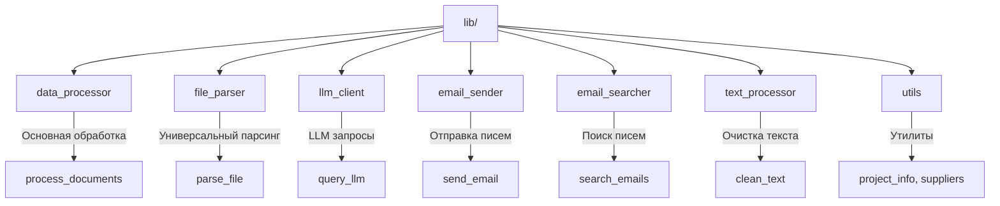
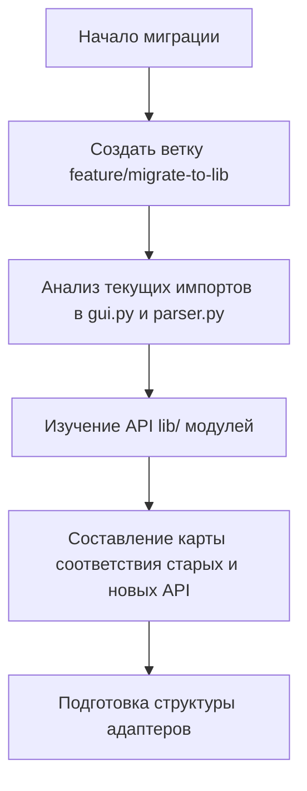
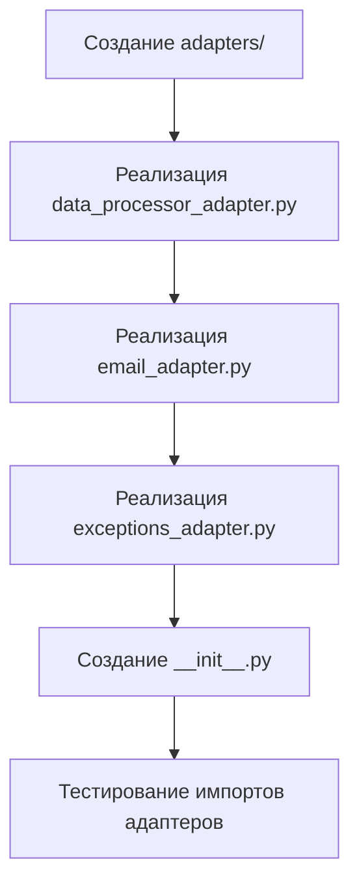
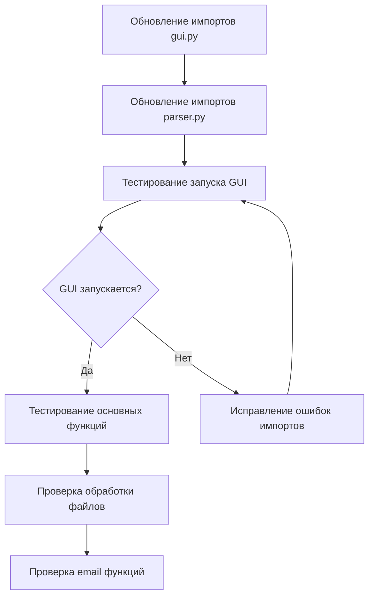
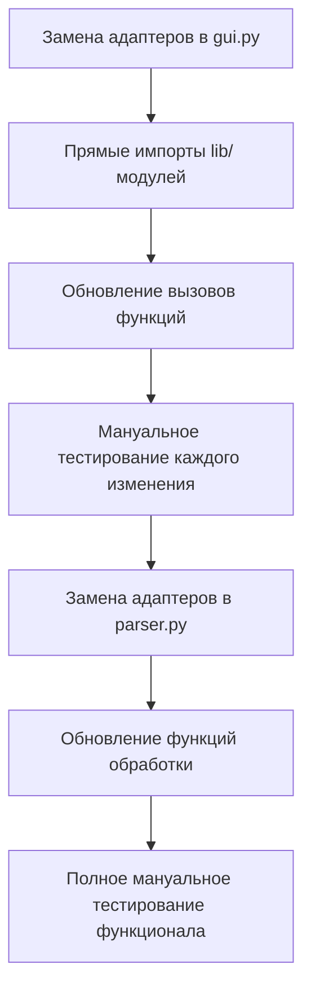
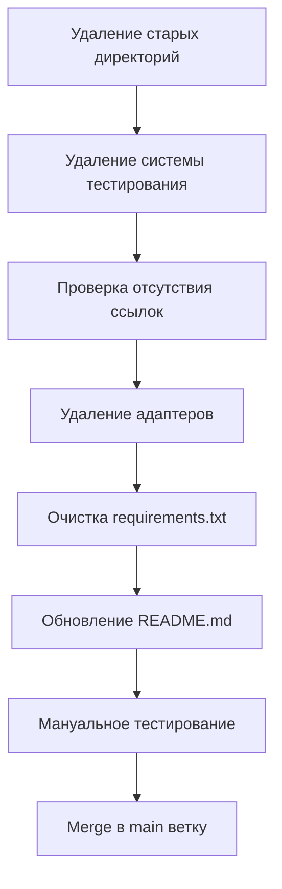

# Миграция на новую архитектуру lib/ и очистка проекта Parser

## Обзор

Цель данной задачи — выполнить полную миграцию проекта Parser с устаревшей модульной архитектуры на новую упрощенную архитектуру lib/, следуя принципам KISS и единой ответственности. После успешной миграции провести очистку устаревшего кода и компонентов.

## Технологический стек

- **Python 3.8+** — основной язык разработки
- **Tkinter** — GUI фреймворк
- **PDF обработка**: pdfplumber, pdf2image, easyocr
- **Excel обработка**: pandas, openpyxl, xlrd
- **LLM интеграция**: OpenRouter API
- **Email**: SMTP/IMAP интеграция

## Архитектура проекта

### Активная архитектура
Проект использует модульную архитектуру с четким разделением ответственности:



### Структура директорий

**Новая архитектура (целевая):**
- `lib/` — упрощенная бизнес-логика следуя принципу KISS
  - `data_processor.py` — основной процессор данных
  - `file_parser.py` — универсальный парсер файлов
  - `llm_client.py` — упрощенный LLM клиент
  - `email_sender.py`, `email_searcher.py` — унифицированные email сервисы
  - `utils.py` — базовые утилиты
  - `integration_example.py` — пример использования

**Старая архитектура (к рефакторингу):**
- `core/`, `parsers/`, `llm/`, `email_service/`, `services/` — устаревшая модульная структура
- `models/` — Pydantic схемы (возможно сохранить)
- `gui/` — GUI компоненты (обновить для использования lib/)
- `tests/` — тестирование (обновить для новой архитектуры)

## Проблемные области

## Преимущества новой архитектуры lib/

### 1. Упрощение и консолидация

**Было (старая архитектура):**
- 5 директорий с множественными модулями
- Сложная система зависимостей
- Разделение между парсерами, LLM, email в разных пакетах

**Стало (новая архитектура lib/):**
- 1 директория с консолидированной логикой
- Простые интерфейсы "все в одном"
- Единые точки входа для каждой функциональности

### 2. Следование принципу KISS

**data_processor.py:**
- Единая функция `process_documents()` вместо сложного pipeline
- Простые параметры без избыточной конфигурации
- Линейная логика обработки

**email_sender.py:**
- Класс `UnifiedEmailSender` автоматически выбирает Gmail API или SMTP
- Простой интерфейс без необходимости знать детали протоколов
- Встроенная обработка ошибок и fallback логика

### 3. Единая ответственность модулей



### 4. Снижение сложности

**Количество файлов:**
- Старая архитектура: ~25 файлов в 5 директориях
- Новая архитектура: 11 файлов в 1 директории

**Точки интеграции:**
- Старая: множественные импорты из разных пакетов
- Новая: простые импорты из lib/

### 2. Устаревшие файлы

**Документация:**
- `REFACTORING_REPORT.md` — отчет о завершенном рефакторинге
- `parser_doc.txt` — устаревшая документация

**Шаблоны:**
- `Шаблон отчета для Parser.txt` — дублирует .j2 файл

## Рекомендации по переходу на новую архитектуру

### Модули к сохранению (новая архитектура lib/)

1. **Директория lib/ (новая архитектура)**
   - Статус: целевая архитектура для использования
   - Принципы: KISS, единственная ответственность, упрощение
   - Преимущества: консолидированная логика, меньше зависимостей

### Старые модули к переработке/удалению

2. **Директории старой архитектуры**
   - `core/`, `parsers/`, `llm/`, `email_service/`, `services/`
   - Причина: замещаются упрощенной архитектурой lib/
   - Действие: постепенный переход и удаление после миграции

3. **Устаревшие документы**
   - `REFACTORING_REPORT.md` — отчет о завершенном процессе
   - `parser_doc.txt` — устаревшая документация
   - `Шаблон отчета для Parser.txt` — дублирует .j2 файл

4. **GUI обновления**
   - Обновить `gui.py` для использования lib/ вместо старых модулей
   - Обновить `parser.py` для новой архитектуры

### Файлы к проверке

1. **Реестр файлов .reg**
   - `install_context_menu.reg`
   - `uninstall_context_menu.reg`
   - Проверить актуальность путей

2. **Директория (37)Петухова(Окулова, 28-35)(Кухня)**
   - Тестовые данные или рабочая папка
   - Требует уточнения статуса

## План выполнения

## Детальный план миграции

### Анализ текущего состояния

**Текущие импорты в gui.py (строки 1-23):**
```python
from services import artifacts
import parser as core
from services.pipeline import run_processing
from email_service.searcher import EmailSearcher
from models.schemas import EmailInfo
from gui.components.email_branch_widget import EmailBranchWidget
```

**Текущие импорты в parser.py (строки 1-11):**
```python
from services.pipeline import run_processing
from email_service import EmailSender
from core.exceptions import ParserError
```

**Целевая архитектура lib/ включает:**
- `data_processor.py` — основной процессор (функция `process_documents`)
- `file_parser.py` — универсальный парсер файлов
- `email_sender.py` — унифицированный email сервис (класс `UnifiedEmailSender`)
- `email_searcher.py` — унифицированный поиск email (класс `UnifiedEmailSearcher`)
- `llm_client.py` — упрощенный LLM клиент
- `utils.py` — утилиты (исключения, проектная логика)
- `integration_example.py` — пример использования

### Этап 1: Подготовка и анализ совместимости

#### 1.1. Проверка API совместимости

**Старый API (services.pipeline.run_processing):**
```python
run_processing(
    cwd=cwd,
    app_fname_selected=app_filename,
    invoice_filenames_selected=invoice_files,
    model=model
) -> Tuple[results, elapsed_time, report, json_file, report_file, card_file]
```

**Новый API (lib.data_processor.process_documents):**
```python
process_documents(
    work_dir=work_dir,
    application_file=application_file,
    invoice_files=invoice_files,
    model=model,
    use_llm_report=False
) -> Tuple[results, elapsed_time, report, output_files]
```

**Различия в API:**
- Названия параметров изменились
- Возвращаемые значения отличаются (output_files вместо отдельных файлов)
- Добавлен параметр use_llm_report

#### 1.2. Анализ зависимостей email

**Старый API:**
- `EmailSender` из `email_service`
- `EmailSearcher` из `email_service.searcher`

**Новый API:**
- `UnifiedEmailSender` из `lib.email_sender`
- `UnifiedEmailSearcher` из `lib.email_searcher`

### Этап 2: Создание адаптеров совместимости

Создать адаптеры для плавного перехода без поломки существующего функционала:

```python
# Адаптер для data_processor
def run_processing_adapter(cwd, app_fname_selected, invoice_filenames_selected, model=None):
    from lib.data_processor import process_documents
    
    results, elapsed_time, report, output_files = process_documents(
        work_dir=cwd,
        application_file=app_fname_selected,
        invoice_files=invoice_filenames_selected,
        model=model,
        use_llm_report=False
    )
    
    # Преобразуем output_files обратно в отдельные переменные
    json_file = output_files.get('json')
    report_file = output_files.get('report')
    card_file = output_files.get('card')
    
    return results, elapsed_time, report, json_file, report_file, card_file
```

### Этап 3: Поэтапная миграция GUI

#### 3.1. Обновление обработки документов
- Заменить `from services.pipeline import run_processing` на адаптер
- Постепенно перейти на прямое использование `lib.data_processor`

#### 3.2. Обновление email функциональности
- Заменить `EmailSender` на `UnifiedEmailSender`
- Заменить `EmailSearcher` на `UnifiedEmailSearcher`
- Обновить методы отправки email

#### 3.3. Обновление обработки файлов
- Использовать `lib.file_parser` вместо отдельных парсеров
- Обновить логику очистки текста через `lib.text_processor`

### Этап 4: Обновление parser.py

#### 4.1. Замена основной логики
```python
# Заменить старые импорты
from lib.data_processor import process_documents
from lib.email_sender import UnifiedEmailSender
from lib.utils import ParserError
```

#### 4.2. Обновление функций
- Обновить `main()` для использования `process_documents`
- Обновить `send_email_with_attachments` для `UnifiedEmailSender`
- Сохранить функции обратной совместимости

### Этап 5: Удаление системы тестирования

#### 5.1. Удаление тестов и связанных файлов
- Удалить директорию tests/
- Удалить pytest.ini
- Очистить requirements.txt от тестовых зависимостей (pytest, pytest-mock, pytest-cov)

#### 5.2. Валидация удаления
- Проверить отсутствие ссылок на тестовую систему
- Убедиться что GUI запускается без тестовых зависимостей
- Мануальное тестирование основного функционала

### Этап 6: Очистка старого кода

#### 6.1. Проверка использования
Перед удалением убедиться, что старые модули не используются:
```bash
grep -r "from core\|from parsers\|from llm\|from email_service\|from services" . --include="*.py"
```

#### 6.2. Постепенное удаление
- Удалить неиспользуемые директории: `core/`, `parsers/`, `llm/`, `email_service/`, `services/`
- Сохранить `models/` и `gui/` с обновлениями
- Удалить устаревшие документы

### Этап 7: Финальная проверка

#### 7.1. Функциональное тестирование
- Запуск GUI и проверка всех функций
- Проверка email функциональности
- Тестирование обработки различных форматов файлов

#### 7.2. Производительность
- Сравнение времени выполнения до и после
- Проверка использования памяти
- Тестирование с большими файлами

### Этап 2: Создание адаптеров совместимости
- [x] Анализ API различий между старой и новой архитектурой
- [ ] Создание директории adapters/
- [ ] Реализация data_processor_adapter.py
- [ ] Реализация email_adapter.py
- [ ] Реализация exceptions_adapter.py
- [ ] Обновление импортов в gui.py и parser.py для использования адаптеров

### Этап 3: Тестирование адаптеров
- [ ] Проверка работы GUI с адаптерами
- [ ] Тестирование основных функций через адаптеры
- [ ] Проверка совместимости email функций
- [ ] Мануальное тестирование основных сценариев

### Этап 4: Прямая миграция на lib/
- [ ] Постепенная замена адаптеров прямыми вызовами lib/ модулей
- [ ] Обновление gui.py для прямого использования lib/
- [ ] Обновление parser.py для прямого использования lib/
- [ ] Мануальное тестирование всех функций

### Этап 5: Очистка устаревшего кода
- [ ] Удаление директорий старой архитектуры (core/, parsers/, llm/, email_service/, services/)
- [ ] Удаление системы тестирования (tests/, pytest.ini)
- [ ] Удаление адаптеров после полной миграции
- [ ] Удаление устаревших документов (REFACTORING_REPORT.md, parser_doc.txt)
- [ ] Обновление README.md под новую архитектуру
- [ ] Очистка requirements.txt от тестовых зависимостей

### Этап 6: Финальная проверка и оптимизация
- [ ] Полное мануальное тестирование всех функций
- [ ] Проверка производительности
- [ ] Валидация соответствия принципам KISS и DRY
- [ ] Проверка работы с различными форматами файлов
- [ ] Документирование изменений и обновление README

## Критерии успеха

1. **Функциональность сохранена**
   - GUI запускается без ошибок
   - Основные функции работают
   - Мануальное тестирование пройдено успешно

2. **Код модернизирован**
   - Переход на новую упрощенную архитектуру lib/
   - Соблюдение принципов KISS и единственной ответственности
   - Устранение избыточной модульности

3. **Соблюдение конвенций**
   - Принцип KISS
   - Отсутствие мертвого кода
   - Четкая структура

## Action Flow для выполнения миграции

### Phase 1: Подготовка и анализ (1-2 часа)


### Phase 2: Создание адаптеров (2-3 часа)


### Phase 3: Интеграция адаптеров (1-2 часа)


### Phase 4: Прямая миграция (3-4 часа)


### Phase 5: Очистка и финализация (2-3 часа)


## Детальные действия по этапам

### Этап 2.1: Создание data_processor_adapter.py
**Действия:**
1. Создать файл `adapters/data_processor_adapter.py`
2. Реализовать функцию `run_processing()` с тем же API что и `services.pipeline.run_processing`
3. Внутри вызывать `lib.data_processor.process_documents()`
4. Преобразовать результат `output_files` обратно в отдельные переменные
5. Добавить логирование с префиксом "Адаптер:"

**Критерии успеха:**
- Функция принимает те же параметры что и старая
- Возвращает результат в том же формате
- Логирует начало и окончание операций
- Обрабатывает исключения

### Этап 2.2: Создание email_adapter.py
**Действия:**
1. Создать классы `EmailSenderAdapter` и `EmailSearcherAdapter`
2. Внутри использовать `UnifiedEmailSender` и `UnifiedEmailSearcher`
3. Создать псевдонимы `EmailSender = EmailSenderAdapter`
4. Обеспечить совместимость методов (`send_email_with_attachments`, `search_emails_by_recipient`)
5. Добавить обработку ошибок и логирование

**Критерии успеха:**
- Старый код работает без изменений
- Новые возможности lib/ модулей доступны
- Gmail API автоматически используется где возможно
- SMTP fallback работает корректно

### Этап 4.1: Прямая миграция gui.py
**Действия:**
1. Заменить `from adapters.data_processor_adapter import run_processing` на `from lib.data_processor import process_documents`
2. Обновить вызов в методе `_run_processing()` для использования нового API
3. Заменить email адаптеры на прямые импорты из lib/
4. Обновить создание email объектов
5. Мануально протестировать после каждого изменения

**Критерии успеха:**
- GUI запускается без ошибок
- Все функции работают как раньше
- Используется новый упрощенный API
- Производительность не ухудшилась

### Этап 5.1: Удаление старых директорий и системы тестирования
**Действия:**
1. Проверить отсутствие импортов: `grep -r "from core\|from parsers\|from llm\|from email_service\|from services" . --include="*.py"`
2. Удалить директории старой архитектуры: `services/`, `email_service/`, `llm/`, `parsers/`, `core/`
3. Удалить систему тестирования: `tests/`, `pytest.ini`
4. Очистить requirements.txt от тестовых зависимостей (`pytest>=7.0.0`, `pytest-mock>=3.10.0`, `pytest-cov>=4.0.0`)
5. После каждого удаления проверять работу GUI
6. Сохранить `models/` и `gui/` (используются)

**Критерии успеха:**
- Нет ошибок импорта после удаления
- GUI работает корректно
- Размер проекта значительно уменьшился
- Структура стала проще и яснее
- **Нет ненужных тестовых зависимостей**

## Риски и митигация

## Контрольные точки и критерии успеха

### Checkpoint 1: Адаптеры созданы и работают
- ✅ Все адаптеры импортируются без ошибок
- ✅ GUI запускается с адаптерами
- ✅ Основные функции работают через адаптеры
- ✅ Email отправка/поиск работает
- ✅ Мануальное тестирование пройдено

### Checkpoint 2: Прямая миграция завершена
- ✅ Нет импортов адаптеров в основном коде
- ✅ Используются только lib/ модули
- ✅ Все функции работают корректно
- ✅ Производительность не ухудшилась
- ✅ Мануальное тестирование всех сценариев пройдено

### Checkpoint 3: Очистка завершена
- ✅ Удалены все старые директории архитектуры
- ✅ Удалена система тестирования и связанные зависимости
- ✅ Нет мертвого кода и неиспользуемых файлов
- ✅ Размер проекта уменьшился на 60%+
- ✅ Структура соответствует принципам KISS
- ✅ Документация обновлена под новую архитектуру

## Откат и восстановление

### Стратегия отката
1. **Git ветки**: каждый этап в отдельном коммите
2. **Резервное копирование**: создание backup/ директории перед началом
3. **Поэтапный откат**: возможность вернуться к любому checkpoint
4. **Тестирование**: на каждом этапе полная проверка функций

### Процедура экстренного отката
```bash
# Откат к последнему рабочему состоянию
git reset --hard HEAD~1

# Восстановление из backup
cp -r backup/* .

# Проверка работоспособности
python gui.py
# Мануальное тестирование основных функций
```

## Риски и митигация

### Технические риски

**Высокий риск:**
- **Поломка GUI функциональности** при неправильной замене API
  - *Митигация*: Создание адаптеров совместимости, поэтапная миграция
- **Потеря данных** при некорректной обработке файлов
  - *Митигация*: Резервное копирование, тщательное тестирование

**Средний риск:**
- **Изменение поведения email** при переходе на UnifiedEmailSender
  - *Митигация*: Параллельное тестирование, сохранение fallback логики
- **Проблемы совместимости** с существующими конфигурациями
  - *Митигация*: Проверка всех конфигурационных параметров

**Низкий риск:**
- **Изменение производительности** при новой архитектуре
  - *Митигация*: Benchmarking до и после миграции

### Операционные риски

**Время выполнения:**
- Миграция может занять 1-2 дня
- Тестирование добавит еще 1 день

**Откат изменений:**
- Git позволяет легко откатиться
- Сохранение старых модулей до полной уверенности

### План минимизации рисков

1. **Создание веток разработки**
   ```bash
   git checkout -b feature/migrate-to-lib-architecture
   ```

2. **Поэтапное выполнение**
   - Каждый этап с отдельным коммитом
   - Промежуточное тестирование
   - Возможность отката на любом этапе

3. **Создание адаптеров**
   - Сохранение старого API через адаптеры
   - Постепенное обновление кода
   - Удаление адаптеров только после полной миграции

4. **Комплексное мануальное тестирование**
   - Тестирование GUI функциональности
   - Проверка email отправки
   - Валидация основных сценариев использования